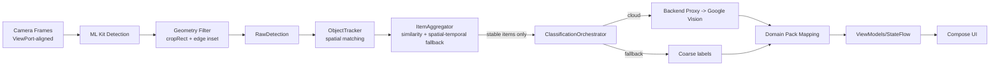

***REMOVED*** Architecture

Single source of truth for how Scanium is structured and how we evolve it. Scanium is a **full-stack mobile application** with Android client, backend services, and observability infrastructure.

---

***REMOVED******REMOVED*** Full System Architecture

***REMOVED******REMOVED******REMOVED*** System Overview

```
┌───────────────────────────────────────────────────────────────────────┐
│                       Android Application                             │
│  • Kotlin + Jetpack Compose + Material 3                             │
│  • CameraX + ML Kit (on-device object detection)                     │
│  • MVVM architecture with StateFlow                                   │
│  • Multi-module: androidApp, shared libs, platform adapters          │
└────────────────────┬──────────────────────────────────────────────────┘
                     │
                     │ HTTPS API calls (ngrok in dev, TLS in prod)
                     │ OTLP telemetry export (logs, traces, metrics)
                     ▼
┌───────────────────────────────────────────────────────────────────────┐
│                     Backend API Server                                │
│  • Node.js 20 + TypeScript + Fastify                                 │
│  • Prisma ORM + PostgreSQL database                                  │
│  • REST API endpoints for item sync, auth, marketplace integration   │
│  • OpenTelemetry instrumentation                                      │
└────────────────────┬──────────────────────────────────────────────────┘
                     │
                     │ OpenTelemetry Protocol (OTLP)
                     ▼
┌───────────────────────────────────────────────────────────────────────┐
│              Observability Stack (LGTM + Alloy)                       │
│  ┌──────────┐   ┌──────┐   ┌───────┐   ┌───────┐   ┌───────┐      │
│  │  Alloy   │──>│ Loki │   │ Tempo │   │ Mimir │   │Grafana│      │
│  │ (Router) │   │(Logs)│   │(Trace)│   │(Metric│   │ (Viz) │      │
│  └──────────┘   └──────┘   └───────┘   └───────┘   └───────┘      │
│  OTLP receiver   14d logs   7d traces   15d metrics  Dashboards      │
└───────────────────────────────────────────────────────────────────────┘
```

***REMOVED******REMOVED******REMOVED*** Component Responsibilities

| Component | Technology | Purpose | Ports |
|-----------|-----------|---------|-------|
| **Android App** | Kotlin, Compose, ML Kit | Camera UI, object detection, local tracking | N/A (mobile) |
| **Backend API** | Node.js, TypeScript, Fastify | REST API, business logic, persistence | 8080 (HTTP) |
| **PostgreSQL** | PostgreSQL 16 (Docker) | Primary database | 5432 |
| **ngrok** | ngrok tunnel | Dev-only: Expose localhost to mobile devices | Dynamic |
| **Grafana** | Grafana 10.3.1 (Docker) | Visualization, dashboards, alerting | 3000 (HTTP) |
| **Alloy** | Grafana Alloy 1.0.0 | OTLP receiver, telemetry router | 4317 (gRPC), 4318 (HTTP) |
| **Loki** | Loki 2.9.3 (Docker) | Log aggregation and storage | 3100 (internal) |
| **Tempo** | Tempo 2.3.1 (Docker) | Distributed tracing backend | 3200 (internal) |
| **Mimir** | Mimir 2.11.0 (Docker) | Prometheus-compatible metrics | 9009 (internal) |

***REMOVED******REMOVED******REMOVED*** Data Flow

**Mobile App → Backend:**
1. User scans object with camera (ML Kit on-device)
2. App tracks objects, confirms stable detections
3. App sends confirmed items to backend API (POST /items)
4. Backend validates, persists to PostgreSQL
5. Backend returns item ID, marketplace listing status

**Telemetry Flow:**
1. Backend exports OTLP data (logs, traces, metrics)
2. Alloy receives on ports 4317/4318, batches, routes
3. Loki stores logs (14-day retention)
4. Tempo stores traces (7-day retention)
5. Mimir stores metrics (15-day retention)
6. Grafana queries all backends for unified dashboards

---

***REMOVED******REMOVED*** Android Application Architecture (Current State)
- **Build/tooling:** Java 17 toolchain; AGP 8.5.0; Kotlin 2.0.0 + Compose compiler 2.0.0; Compose BOM 2024.05.00 in `androidApp`; KSP 2.0.0-1.0.24. `./gradlew assembleDebug` is the main gate; SBOM + OWASP checks in `androidApp`.
- **Dependency Injection:** Dagger Hilt for DI (`@HiltViewModel`, `@AndroidEntryPoint`, `@Inject`). ViewModels use `@HiltViewModel` for automatic injection; `MainActivity` annotated with `@AndroidEntryPoint`.
- **Modules:**
  - Platform UI: `androidApp/` (Compose, navigation, view models).
  - Platform scanning: `android-camera-camerax` (CameraX), `android-ml-mlkit` (ML Kit analyzers), `android-platform-adapters` (Bitmap/Rect adapters).
  - Shared brain: `shared/core-models` (ImageRef, NormalizedRect, RawDetection, DetectionResult, ItemCategory + classification/config contracts), `shared/core-tracking` (ObjectTracker, math).
  - Domain taxonomy: `core-domainpack` (DomainPackRepository, BasicCategoryEngine, JSON config).
  - Shell namespaces: `core-contracts`, `core-scan`, `shared:test-utils` (test helpers for shared modules).
  - Android wrappers: `core-models`, `core-tracking` (typealiases to shared KMP).
- **Pipeline today:** CameraX (with WYSIWYG ViewPort alignment) → ML Kit detection → geometry-based filtering (edge gating) → adapters to `RawDetection` → `ObjectTracker` + `ItemAggregator` (with spatial-temporal merge fallback) → `ClassificationOrchestrator` (cloud/offline paths) → UI state in view models. Cloud classifier is config-driven via `BuildConfig`/`local.properties`; on-device labels act as fallback when unset.
  - **WYSIWYG Viewport (2024-12):** Preview + ImageAnalysis bound via `UseCaseGroup` with shared `ViewPort` ensures ML analysis sees only what user sees in Preview; eliminates off-screen phantom detections.
  - **Edge Gating (2024-12):** Geometry-based filtering using `ImageProxy.cropRect` + configurable inset margin (default 10%) drops partial/cut-off objects at screen edges; zero per-frame bitmap cropping.
  - **Spatial-Temporal Dedupe (2024-12):** Lightweight fallback merge policy in `shared/core-tracking` handles tracker ID churn via IoU/distance matching within time window (default 800ms); minimal memory footprint.

---

***REMOVED******REMOVED******REMOVED*** Developer Options & Diagnostics (Debug-only)

The `androidApp/diagnostics/` package provides runtime health checks and system diagnostics, accessible via Developer Options in Settings:

**Components:**
- `DiagnosticsRepository`: Performs health checks (backend /health endpoint, network status, permissions, capabilities) and generates clipboard-ready summaries
- `DeveloperOptionsViewModel`: Manages diagnostics state, auto-refresh (15s interval), and developer settings
- `DeveloperOptionsScreen`: Material 3 UI with System Health panel, status indicators, and debug controls

**Diagnostics State:**
```kotlin
data class DiagnosticsState(
    backendHealth: HealthCheckResult,    // Backend /health endpoint status + latency
    networkStatus: NetworkStatus,         // WiFi/Cellular/VPN, metered status
    permissions: List<PermissionStatus>,  // Camera, Microphone grant status
    capabilities: List<CapabilityStatus>, // Speech recognition, TTS, camera lenses
    appConfig: AppConfigSnapshot          // Version, build type, device, base URL
)
```

**Features:**
- Real-time backend connectivity check with latency display
- Network transport detection (WiFi/Cellular/Ethernet/VPN)
- Permission and capability status indicators
- App configuration snapshot (version, device, SDK, base URL)
- Auto-refresh toggle (15-second interval)
- Copy diagnostics summary to clipboard
- FTUE tour controls and crash test triggers

---

***REMOVED******REMOVED*** Target Architecture (layers)
- **Presentation (platform-specific):** Compose UI (Android), future SwiftUI (iOS). Pure UI + state wiring only.
- **Platform Scanning Layer:** Camera + on-device detectors; emits portable `RawDetection` + thumbnails. Android = CameraX/ML Kit; iOS (future) = AVFoundation/Apple Vision.
- **Shared Brain (portable/KMP-ready):** Models, tracking/aggregation, classification/config contracts, domain mapping. No Android types allowed.
- **Integration:** `androidApp` wires platform scanning to shared brain and domain pack; iOS will mirror the same contracts later.

Mermaid (layered view):
```mermaid
flowchart TD
    UI[Presentation: Compose/SwiftUI] --> VM[ViewModels]
    VM --> Platform[Platform Scanning Layer<br/>CameraX+ML Kit / AVFoundation+Vision]
    Platform --> Adapters[Platform Adapters<br/>Bitmap/Rect -> ImageRef/NormalizedRect]
    Adapters --> Tracking[Shared Tracking & Aggregation]
    Tracking --> Classify[Classification Orchestrator]
    Classify --> Cloud[Cloud Classifier (backend proxy -> Google Vision)]
    Classify --> Fallback[On-device labels (fallback)]
    Classify --> Domain[Domain Pack Mapping]
    Domain --> VM
```

---

***REMOVED******REMOVED*** Data Flow (stable items only for cloud)
1. Camera frame (with ViewPort-aligned cropRect) → ML Kit detector → **geometry filtering** (drop detections outside visible viewport + edge inset) → `RawDetection` (normalized bbox, coarse label, thumbnail).
2. `ObjectTracker` processes frame-level detections (spatial matching + ID tracking); `ItemAggregator` merges via similarity scoring + **spatial-temporal fallback** (handles ID churn); only **stable items** (confirmed + thumbnail) are eligible for cloud upload.
3. `ClassificationOrchestrator` (bounded concurrency=2, retries) decides mode:
   - `CLOUD`: send thumbnail to backend proxy (Google Vision), async.
   - `ON_DEVICE`/`FALLBACK`: use coarse labels when cloud unavailable/unconfigured.
4. `DomainPackRepository` + `BasicCategoryEngine` map classifier output to domain categories/attributes.
5. View models push updated UI state (overlays, item list, selling flow).

**Performance characteristics:**
- Edge filtering: zero allocations (primitives only), no bitmap operations.
- Spatial-temporal merge: O(1) per candidate, stores only bbox center + timestamp + category.
- Rate-limited logging prevents log spam (viewport: once, cropRect: 5s, edge drops: 5s).

Mermaid (pipeline):


---

***REMOVED******REMOVED*** Deduplication & Detection Quality Configuration

**WYSIWYG Viewport Alignment:**
- **Location:** `CameraXManager.kt` (androidApp)
- **Mechanism:** `ViewPort` + `UseCaseGroup` ensures Preview and ImageAnalysis share the same field of view.
- **Result:** ML analysis only processes pixels visible to the user; eliminates off-screen "phantom" detections.

**Edge Gating (Geometry-Based Filtering):**
- **Location:** `ObjectDetectorClient.kt` (android-ml-mlkit)
- **Configuration:** `CameraXManager.EDGE_INSET_MARGIN_RATIO` (default: 0.10 = 10% inset from each edge)
- **Mechanism:** Filter detections whose center falls outside `ImageProxy.cropRect` minus inset margin.
- **Performance:** Zero allocations; uses primitive int/float arithmetic only; no bitmap operations.
- **Tuning:** Increase ratio (e.g., 0.15) for stricter filtering; decrease (e.g., 0.05) to allow more edge objects.

**Spatial-Temporal Merge Policy:**
- **Location:** `SpatialTemporalMergePolicy.kt` (shared/core-tracking - Android-free)
- **Purpose:** Fallback deduplication when tracker IDs churn or regular similarity scoring fails.
- **Configuration:** `MergeConfig` with presets:
  ```kotlin
  // Default: balanced merge decisions
  val DEFAULT = MergeConfig(
      timeWindowMs = 800L,           // Merge within 800ms
      minIoU = 0.3f,                 // Minimum overlap 30%
      requireCategoryMatch = true,    // Categories must match
      useIoU = true                   // Use IoU vs center distance
  )

  // Strict: fewer merges, more conservative
  val STRICT = MergeConfig(
      timeWindowMs = 500L,
      minIoU = 0.5f,
      requireCategoryMatch = true
  )

  // Lenient: more merges, less conservative
  val LENIENT = MergeConfig(
      timeWindowMs = 1200L,
      minIoU = 0.2f,
      requireCategoryMatch = false
  )
  ```
- **Metrics:** IoU (Intersection over Union) or normalized center distance.
- **Memory:** Stores only bbox center (2 floats), timestamp (1 long), category (1 int) per candidate.
- **Integration:** `ItemAggregator` consults merge policy when similarity scoring fails.

**Performance Impact:**
- CPU: Negligible (geometry checks use primitives; no image processing).
- Memory: Minimal (~24 bytes per active candidate in merge cache).
- Latency: No measurable impact (filtering happens before expensive operations).

---

***REMOVED******REMOVED*** Module/Package Boundaries & Dependency Rules
- Shared modules (`shared/*`) are Android-free; enforced by `checkPortableModules`.
- Platform modules (`android-*`) do not depend on each other except adapters can be a leaf helper; none depend on `androidApp`.
- `androidApp` is the only integration point (wires UI + platform + shared).
- `core-domainpack` depends on shared models but not on platform code.
- Shell modules (`core-contracts`, `core-scan`) stay lightweight; no Android types.

***REMOVED******REMOVED*** Security posture (concise)
- Network + classification defaults keep processing on-device; cloud classification only activates when `SCANIUM_API_BASE_URL`/`SCANIUM_API_KEY` are set (via `local.properties` or environment). See `androidApp/build.gradle.kts` BuildConfig entries.
- OWASP Dependency-Check and CycloneDX SBOM run from `androidApp` (see Gradle plugins) and are exercised via `security-cve-scan.yml`.
- Android network security config lives at `androidApp/src/main/res/xml/network_security_config.xml`; release builds enable R8/ProGuard per `proguard-rules.pro`.

---

***REMOVED******REMOVED*** Cloud Classification Flow (Google Vision via backend proxy)
- **Trigger:** Only stable aggregated items with thumbnails.
- **Config:** `CloudClassifierConfig` + `CloudConfigProvider` (Android impl reads BuildConfig from `local.properties`/env: `scanium.api.base.url`, `scanium.api.key`). No secrets in source.
- **Transport:** OkHttp multipart JPEG upload to backend proxy; timeouts 10s/10s; retries on 408/429/5xx; EXIF stripped via re-encode.
- **Backend:** Holds Google credentials, rate limits, logs, maps Vision output to domain categories.
- **Fallback:** When config missing or network down, orchestrator uses on-device labels; results marked as fallback.
- **Testing:** Mock classifier for JVM tests; cloud path optional/gated by env.

---

***REMOVED******REMOVED*** Vision → Classification → Assistant Pipeline

This section describes the end-to-end flow from camera scan to assistant output, including attribute extraction and enrichment.

***REMOVED******REMOVED******REMOVED*** Pipeline Overview

```
[Camera Scan]
    ↓
[Layer A: Local OCR/Colors] ── ML Kit Text Recognition + Android Palette (~100-200ms)
    ↓                         Results applied IMMEDIATELY
[Layer B: Cloud Vision] ───── POST /v1/vision/insights (~1-2s)
    ↓                         Returns: logos, colors, labels, itemType, suggestedLabel
[Layer C: Enrichment] ─────── POST /v1/items/enrich (~5-15s)
    ↓                         Returns: normalized attributes, draft title/description
[UI Display] ──────────────── displayLabel shows "Brand ItemType · Color"
    ↓
[Assistant Context] ────────── ItemContextSnapshot with all extracted attributes
```

***REMOVED******REMOVED******REMOVED*** Key Concepts

**itemType vs category:**
- `category` = High-level classification (e.g., "Cosmetics", "Electronics", "Fashion")
- `itemType` = Concrete sellable noun (e.g., "Lip Balm", "Tissue Box", "T-Shirt")
- `itemType` is the PRIMARY UX label; `category` is secondary/internal

**Direct vs derived attributes:**
- **Direct (Vision):** brand (from logos), color (from color detection), ocrText (from OCR)
- **Derived (Backend):** itemType (from Vision labels → mapping), suggestedLabel (brand + itemType)

**When Vision is used:**
- Layer A (Local): Always, immediately after scan - ML Kit OCR + Android Palette
- Layer B (Cloud): When network available - Google Vision API via backend proxy
- Layer C (Enrichment): For full draft generation - Vision + LLM reasoning

**When LLM is allowed:**
- Only in Layer C (enrichment) for draft title/description generation
- Fallback to template-based generation when LLM unavailable
- LLM NEVER used for attribute extraction (pure Vision-first approach)

***REMOVED******REMOVED******REMOVED*** Step-by-Step Sequence

1. **Camera captures frame** → `CameraScreen.kt` triggers `addItemsWithVisionPrefill()`
2. **Item created** → `ItemsStateManager.addItemsSync()` assigns `aggregatedId`
3. **Layer A extraction** → `LocalVisionExtractor.extract()` runs ML Kit OCR + Palette
4. **Layer A applied** → `ItemsStateManager.applyVisionInsights()` updates item immediately
5. **Layer B extraction** → `VisionInsightsRepository.extractInsights()` calls backend
6. **Backend Vision** → `backend/src/modules/vision/routes.ts` calls Google Vision API
7. **itemType derived** → `deriveItemType()` maps Vision labels to concrete nouns
8. **Layer B applied** → Results merged (cloud takes precedence over local)
9. **Layer C enrichment** → `EnrichmentRepository.enrichItem()` for full pipeline
10. **Attributes normalized** → Backend maps `product_type` → Android receives as `itemType`
11. **UI displays** → `ScannedItem.displayLabel` shows "Brand ItemType · Color"
12. **Assistant clicked** → `ListingDraftBuilder.build()` extracts all attributes
13. **Context sent** → `ItemContextSnapshot` includes itemType, detectedText, brand, color
14. **Description generated** → Assistant uses structured context for specific output

***REMOVED******REMOVED******REMOVED*** Key Files

| Component | File | Purpose |
|-----------|------|---------|
| Local extraction | `androidApp/.../ml/LocalVisionExtractor.kt` | ML Kit OCR + Palette API |
| Cloud extraction | `androidApp/.../ml/VisionInsightsRepository.kt` | POST /v1/vision/insights |
| Enrichment | `androidApp/.../enrichment/EnrichmentRepository.kt` | POST /v1/items/enrich |
| State management | `androidApp/.../items/state/ItemsStateManager.kt` | `applyVisionInsights()` |
| Vision prefiller | `androidApp/.../ml/VisionInsightsPrefiller.kt` | 3-layer pipeline orchestration |
| Draft builder | `shared/.../listing/ListingDraft.kt` | `ListingDraftBuilder.buildFields()` |
| Backend Vision | `backend/src/modules/vision/routes.ts` | `deriveItemType()`, Vision API |
| Backend Enrichment | `backend/src/modules/enrich/pipeline.ts` | 3-stage enrichment pipeline |

***REMOVED******REMOVED******REMOVED*** Attribute Schema

```kotlin
// VisionAttributes (raw Vision data)
data class VisionAttributes(
    val colors: List<VisionColor>,      // Detected colors with scores
    val ocrText: String?,               // OCR text snippets
    val logos: List<VisionLogo>,        // Brand logos detected
    val labels: List<VisionLabel>,      // Category/material labels
    val brandCandidates: List<String>,  // Brand candidates from logos/OCR
    val itemType: String?,              // Sellable item type noun
)

// ItemAttribute (normalized for UI/assistant)
data class ItemAttribute(
    val value: String,
    val confidence: Float,              // 0.0-1.0
    val source: String,                 // e.g., "enrichment-vision_logo"
)

// DraftFieldKey (assistant context keys)
enum class DraftFieldKey {
    CATEGORY, CONDITION, BRAND, MODEL, COLOR,
    ITEM_TYPE,      // Sellable item type noun
    DETECTED_TEXT,  // OCR text snippets
}
```

---

***REMOVED******REMOVED*** Vision Golden Tests Strategy

Golden tests validate the complete Vision extraction pipeline using real product images, ensuring:
- OCR correctly extracts text (brand names, product info)
- Logo detection identifies brands
- Color extraction provides dominant colors
- Label detection provides category hints
- itemType derivation produces concrete sellable nouns

***REMOVED******REMOVED******REMOVED*** Why Golden Images Exist

1. **Regression protection:** Detect silent failures in Vision API or derivation logic
2. **End-to-end validation:** Test full pipeline from image to structured attributes
3. **Deterministic verification:** Compare actual output against expected attributes
4. **CI integration:** Run without external API calls using cached/mock responses

***REMOVED******REMOVED******REMOVED*** What They Protect Against

- Vision API response format changes
- Derivation logic regressions (e.g., itemType mapping)
- Attribute key mismatches (e.g., `product_type` vs `itemType`)
- Confidence threshold changes affecting output
- OCR/logo/color extraction quality degradation

***REMOVED******REMOVED******REMOVED*** Image Selection Criteria

Golden images should be:
- **Clear:** Well-lit, focused, representative of real scanning conditions
- **Real-world:** Not studio-perfect; include typical user scenarios
- **Brand/text visible:** Logo or text clearly readable for OCR/logo detection
- **Compressed:** Max 800px longest side, ≤200KB to minimize Git footprint
- **Diverse:** Cover target categories (cosmetics, household, apparel, electronics)

***REMOVED******REMOVED******REMOVED*** Validation Approach

```typescript
// Example golden test assertions (backend)
expect(body.ocrSnippets.length).toBeGreaterThan(0);
expect(body.itemType).toBeDefined();
expect(body.suggestedLabel).toBeDefined();

// Verify specific brand detection
const ocrText = body.ocrSnippets.join(' ').toLowerCase();
expect(ocrText).toContain('kleenex');

// Verify itemType derivation
const itemTypeLower = body.itemType.toLowerCase();
expect(itemTypeLower.includes('tissue') || itemTypeLower.includes('box')).toBe(true);
```

***REMOVED******REMOVED******REMOVED*** Golden Test Files

| File | Purpose |
|------|---------|
| `backend/src/modules/vision/routes.golden.test.ts` | Vision insights extraction test |
| `backend/src/modules/enrich/routes.golden.test.ts` | Full enrichment pipeline test |
| `tests/golden_images/` | Golden image assets |
| `androidApp/src/test/resources/golden/` | Android golden test fixtures |

---

***REMOVED******REMOVED*** Build Guardrails
- Java 17 toolchain (root + androidApp).
- Commands: `./gradlew assembleDebug` (must stay green), `./gradlew test` (fast, offline), `./gradlew connectedAndroidTest` (device-only), `./gradlew lint` (optional/CI).
- Security/lint: CycloneDX + OWASP Dependency Check active in `androidApp`.

---

***REMOVED******REMOVED*** Cross-Platform Readiness (iOS Prep)
- Contracts and models live in shared modules; no Android imports.
- Future iOS will implement:
  - Platform scanning adapter (Vision/AVFoundation → `RawDetection`/`ImageRef`).
  - Cloud classifier client using the same `CloudClassifierConfig`.
- Android remains unblocked; shared code already compiles for Android; iOS targets can be added later without touching Android.

---

***REMOVED******REMOVED*** Backend Services Architecture

***REMOVED******REMOVED******REMOVED*** Technology Stack
- **Runtime:** Node.js 20+ with TypeScript 5.x
- **Framework:** Fastify for HTTP server
- **ORM:** Prisma for type-safe database access
- **Database:** PostgreSQL 16 (Alpine Docker image)
- **Dev Tools:** ngrok for mobile device tunneling
- **Telemetry:** OpenTelemetry SDK for logs, traces, metrics

***REMOVED******REMOVED******REMOVED*** Directory Structure
```
backend/
├── src/
│   ├── index.ts              ***REMOVED*** Fastify server entry point
│   ├── routes/               ***REMOVED*** API endpoint definitions
│   │   ├── items.ts          ***REMOVED*** Item CRUD operations
│   │   ├── auth/             ***REMOVED*** Authentication endpoints
│   │   └── health.ts         ***REMOVED*** Health check endpoint
│   ├── services/             ***REMOVED*** Business logic layer
│   ├── middleware/           ***REMOVED*** Fastify plugins (auth, validation)
│   └── types/                ***REMOVED*** TypeScript type definitions
├── prisma/
│   ├── schema.prisma         ***REMOVED*** Database schema (models, relations)
│   ├── migrations/           ***REMOVED*** Version-controlled schema changes
│   └── seed.ts               ***REMOVED*** Database seeding script
├── docker-compose.yml        ***REMOVED*** PostgreSQL container definition
├── package.json
├── tsconfig.json
└── .env                      ***REMOVED*** Environment vars (gitignored)
```

***REMOVED******REMOVED******REMOVED*** API Endpoints (Current)
- `GET /healthz` - Health check (used by startup scripts)
- `POST /auth/ebay/start` - Initiate eBay OAuth flow
- `GET /auth/ebay/callback` - eBay OAuth callback handler
- `GET /auth/ebay/status` - Check eBay connection status
- *(Additional endpoints to be documented as implemented)*

***REMOVED******REMOVED******REMOVED*** Database Schema (Prisma)
- **Items:** Scanned objects with metadata, category, pricing
- **Users:** User accounts and authentication
- **ListingDrafts:** Marketplace listing drafts
- *(Schema evolves with migrations; see `prisma/schema.prisma`)*

---

***REMOVED******REMOVED*** Observability Stack Architecture

***REMOVED******REMOVED******REMOVED*** LGTM Stack Components

**Grafana Alloy (OTLP Router):**
- Receives telemetry from backend via OTLP (gRPC port 4317, HTTP port 4318)
- Batches and routes data to appropriate backends (Loki, Tempo, Mimir)
- Provides admin UI on localhost:12345 for debugging
- Configuration: `monitoring/alloy/alloy.hcl`

**Loki (Log Aggregation):**
- Stores structured logs with labels
- 14-day retention by default (configurable)
- Accessible via Grafana datasource
- Local storage: `monitoring/data/loki/`
- Config: `monitoring/loki/loki.yaml`

**Tempo (Distributed Tracing):**
- Stores distributed traces with span relationships
- 7-day retention by default
- Supports TraceQL for advanced queries
- Local storage: `monitoring/data/tempo/`
- Config: `monitoring/tempo/tempo.yaml`

**Mimir (Metrics Storage):**
- Prometheus-compatible metrics storage
- 15-day retention by default
- Supports PromQL queries
- Local storage: `monitoring/data/mimir/`
- Config: `monitoring/mimir/mimir.yaml`

**Grafana (Visualization):**
- Dashboard UI on port 3000
- Pre-configured datasources (Loki, Tempo, Mimir)
- Pre-provisioned dashboards from `monitoring/grafana/dashboards/`
- Anonymous admin access for local dev (disable in production)
- Persistent storage: `monitoring/data/grafana/`

***REMOVED******REMOVED******REMOVED*** Monitoring Stack Management

**Startup:**
```bash
***REMOVED*** Integrated with backend
scripts/backend/start-dev.sh              ***REMOVED*** Starts backend + monitoring

***REMOVED*** Standalone monitoring
scripts/monitoring/start-monitoring.sh    ***REMOVED*** Monitoring only
```

**Status & URLs:**
```bash
scripts/monitoring/print-urls.sh          ***REMOVED*** Health checks, access URLs
```

**Shutdown:**
```bash
scripts/backend/stop-dev.sh --with-monitoring  ***REMOVED*** Stop everything
scripts/monitoring/stop-monitoring.sh          ***REMOVED*** Stop monitoring only
```

**Container Management:**
- Project name: `scanium-monitoring` (avoids collisions)
- Network: `scanium-observability` (bridge)
- Logs: `docker compose -p scanium-monitoring logs -f [service]`
- Restart: `docker compose -p scanium-monitoring restart [service]`

***REMOVED******REMOVED******REMOVED*** Data Persistence
- All data stored in `monitoring/data/` (gitignored)
- Grafana settings, users, dashboards persist across restarts
- To reset all monitoring data: `rm -rf monitoring/data/*`
- Dashboards provisioned from `monitoring/grafana/dashboards/` (version-controlled)

---

***REMOVED******REMOVED*** Development Workflow

***REMOVED******REMOVED******REMOVED*** One-Command Dev Environment

The `scripts/backend/start-dev.sh` script provides integrated startup:

**What it does:**
1. ✅ Validates prerequisites (Node.js, Docker, ngrok)
2. ✅ Starts PostgreSQL container (health checks)
3. ✅ Starts backend server (health checks on /healthz)
4. ✅ Starts ngrok tunnel (extracts public URL)
5. ✅ Optionally starts monitoring stack (default: enabled)
6. ✅ Displays all access URLs and management commands
7. ✅ Handles graceful shutdown on Ctrl+C

**Flags:**
- `--with-monitoring` (default) - Start monitoring stack
- `--no-monitoring` - Skip monitoring stack
- `MONITORING=0/1` env var override

**Idempotency:**
- Safe to run multiple times
- Detects already-running containers
- No duplicate containers created

**Output:**
- Backend: http://localhost:8080
- ngrok: Public URL (updates .env if changed)
- Grafana: http://localhost:3000 (if monitoring enabled)
- OTLP: localhost:4317 (gRPC), localhost:4318 (HTTP)

***REMOVED******REMOVED******REMOVED*** Mobile Device Testing Workflow

1. Run `scripts/backend/start-dev.sh`
2. Note the ngrok URL (e.g., https://abc123.ngrok-free.dev)
3. Update Android app's `SettingsScreen.kt` with ngrok URL
4. Rebuild and install app on mobile device
5. App communicates with backend via ngrok tunnel
6. View telemetry in Grafana dashboards

***REMOVED******REMOVED******REMOVED*** Debugging & Troubleshooting

**Backend logs:**
```bash
tail -f backend/.dev-server.log
```

**PostgreSQL logs:**
```bash
docker logs scanium-postgres
```

**Monitoring services:**
```bash
docker compose -p scanium-monitoring logs -f grafana
docker compose -p scanium-monitoring logs -f alloy
```

**Health checks:**
```bash
curl http://localhost:8080/healthz          ***REMOVED*** Backend
curl http://localhost:3000/api/health       ***REMOVED*** Grafana
curl http://localhost:3100/ready            ***REMOVED*** Loki
curl http://localhost:3200/ready            ***REMOVED*** Tempo
curl http://localhost:9009/ready            ***REMOVED*** Mimir
```

---

***REMOVED******REMOVED*** Roadmap (high level)
- ✅ Backend API server with PostgreSQL (done)
- ✅ Observability stack with LGTM + Alloy (done)
- ✅ Integrated dev startup workflow (done)
- ✅ Harden shared contracts and config (done)
- ✅ Developer Options with System Health diagnostics (done)
- ✅ WCAG 2.1 accessibility compliance (done)
- Adapt orchestrator to shared contracts; add mocks/tests
- Route classifier outputs through domain pack mapping and surface status in UI
- Add iOS clients against the same contracts once Android path is stable
- Production deployment configuration (Kubernetes/Cloud Run)
- Backend API authentication and authorization
- End-to-end telemetry from Android app to Grafana
