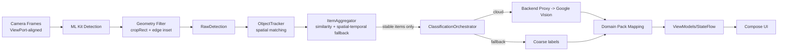

# Architecture

Single source of truth for how Scanium is structured and how we evolve it. Goal: ship Android first, keep builds green, keep cloud classification optional/configurable, and grow a shared “brain” that iOS can consume without blocking Android.

---

## Current State (from repo inspection)
- **Build/tooling:** Java 17 toolchain; AGP 8.5.0; Kotlin 2.0.0 + Compose compiler 2.0.0; Compose BOM 2024.05.00 in `androidApp`; KSP 2.0.0-1.0.24. `./gradlew assembleDebug` is the main gate; SBOM + OWASP checks in `androidApp`.
- **Modules:**
  - Platform UI: `androidApp/` (Compose, navigation, view models).
  - Platform scanning: `android-camera-camerax` (CameraX), `android-ml-mlkit` (ML Kit analyzers), `android-platform-adapters` (Bitmap/Rect adapters).
  - Shared brain: `shared/core-models` (ImageRef, NormalizedRect, RawDetection, DetectionResult, ItemCategory + classification/config contracts), `shared/core-tracking` (ObjectTracker, math).
  - Domain taxonomy: `core-domainpack` (DomainPackRepository, BasicCategoryEngine, JSON config).
  - Shell namespaces: `core-contracts`, `core-scan`, `shared:test-utils` (test helpers for shared modules).
  - Android wrappers: `core-models`, `core-tracking` (typealiases to shared KMP).
- **Pipeline today:** CameraX (with WYSIWYG ViewPort alignment) → ML Kit detection → geometry-based filtering (edge gating) → adapters to `RawDetection` → `ObjectTracker` + `ItemAggregator` (with spatial-temporal merge fallback) → `ClassificationOrchestrator` (cloud/offline paths) → UI state in view models. Cloud classifier is config-driven via `BuildConfig`/`local.properties`; on-device labels act as fallback when unset.
  - **WYSIWYG Viewport (2024-12):** Preview + ImageAnalysis bound via `UseCaseGroup` with shared `ViewPort` ensures ML analysis sees only what user sees in Preview; eliminates off-screen phantom detections.
  - **Edge Gating (2024-12):** Geometry-based filtering using `ImageProxy.cropRect` + configurable inset margin (default 10%) drops partial/cut-off objects at screen edges; zero per-frame bitmap cropping.
  - **Spatial-Temporal Dedupe (2024-12):** Lightweight fallback merge policy in `shared/core-tracking` handles tracker ID churn via IoU/distance matching within time window (default 800ms); minimal memory footprint.

---

## Target Architecture (layers)
- **Presentation (platform-specific):** Compose UI (Android), future SwiftUI (iOS). Pure UI + state wiring only.
- **Platform Scanning Layer:** Camera + on-device detectors; emits portable `RawDetection` + thumbnails. Android = CameraX/ML Kit; iOS (future) = AVFoundation/Apple Vision.
- **Shared Brain (portable/KMP-ready):** Models, tracking/aggregation, classification/config contracts, domain mapping. No Android types allowed.
- **Integration:** `androidApp` wires platform scanning to shared brain and domain pack; iOS will mirror the same contracts later.

Mermaid (layered view):
```mermaid
flowchart TD
    UI[Presentation: Compose/SwiftUI] --> VM[ViewModels]
    VM --> Platform[Platform Scanning Layer<br/>CameraX+ML Kit / AVFoundation+Vision]
    Platform --> Adapters[Platform Adapters<br/>Bitmap/Rect -> ImageRef/NormalizedRect]
    Adapters --> Tracking[Shared Tracking & Aggregation]
    Tracking --> Classify[Classification Orchestrator]
    Classify --> Cloud[Cloud Classifier (backend proxy -> Google Vision)]
    Classify --> Fallback[On-device labels (fallback)]
    Classify --> Domain[Domain Pack Mapping]
    Domain --> VM
```

---

## Data Flow (stable items only for cloud)
1. Camera frame (with ViewPort-aligned cropRect) → ML Kit detector → **geometry filtering** (drop detections outside visible viewport + edge inset) → `RawDetection` (normalized bbox, coarse label, thumbnail).
2. `ObjectTracker` processes frame-level detections (spatial matching + ID tracking); `ItemAggregator` merges via similarity scoring + **spatial-temporal fallback** (handles ID churn); only **stable items** (confirmed + thumbnail) are eligible for cloud upload.
3. `ClassificationOrchestrator` (bounded concurrency=2, retries) decides mode:
   - `CLOUD`: send thumbnail to backend proxy (Google Vision), async.
   - `ON_DEVICE`/`FALLBACK`: use coarse labels when cloud unavailable/unconfigured.
4. `DomainPackRepository` + `BasicCategoryEngine` map classifier output to domain categories/attributes.
5. View models push updated UI state (overlays, item list, selling flow).

**Performance characteristics:**
- Edge filtering: zero allocations (primitives only), no bitmap operations.
- Spatial-temporal merge: O(1) per candidate, stores only bbox center + timestamp + category.
- Rate-limited logging prevents log spam (viewport: once, cropRect: 5s, edge drops: 5s).

Mermaid (pipeline):


---

## Deduplication & Detection Quality Configuration

**WYSIWYG Viewport Alignment:**
- **Location:** `CameraXManager.kt` (androidApp)
- **Mechanism:** `ViewPort` + `UseCaseGroup` ensures Preview and ImageAnalysis share the same field of view.
- **Result:** ML analysis only processes pixels visible to the user; eliminates off-screen "phantom" detections.

**Edge Gating (Geometry-Based Filtering):**
- **Location:** `ObjectDetectorClient.kt` (android-ml-mlkit)
- **Configuration:** `CameraXManager.EDGE_INSET_MARGIN_RATIO` (default: 0.10 = 10% inset from each edge)
- **Mechanism:** Filter detections whose center falls outside `ImageProxy.cropRect` minus inset margin.
- **Performance:** Zero allocations; uses primitive int/float arithmetic only; no bitmap operations.
- **Tuning:** Increase ratio (e.g., 0.15) for stricter filtering; decrease (e.g., 0.05) to allow more edge objects.

**Spatial-Temporal Merge Policy:**
- **Location:** `SpatialTemporalMergePolicy.kt` (shared/core-tracking - Android-free)
- **Purpose:** Fallback deduplication when tracker IDs churn or regular similarity scoring fails.
- **Configuration:** `MergeConfig` with presets:
  ```kotlin
  // Default: balanced merge decisions
  val DEFAULT = MergeConfig(
      timeWindowMs = 800L,           // Merge within 800ms
      minIoU = 0.3f,                 // Minimum overlap 30%
      requireCategoryMatch = true,    // Categories must match
      useIoU = true                   // Use IoU vs center distance
  )

  // Strict: fewer merges, more conservative
  val STRICT = MergeConfig(
      timeWindowMs = 500L,
      minIoU = 0.5f,
      requireCategoryMatch = true
  )

  // Lenient: more merges, less conservative
  val LENIENT = MergeConfig(
      timeWindowMs = 1200L,
      minIoU = 0.2f,
      requireCategoryMatch = false
  )
  ```
- **Metrics:** IoU (Intersection over Union) or normalized center distance.
- **Memory:** Stores only bbox center (2 floats), timestamp (1 long), category (1 int) per candidate.
- **Integration:** `ItemAggregator` consults merge policy when similarity scoring fails.

**Performance Impact:**
- CPU: Negligible (geometry checks use primitives; no image processing).
- Memory: Minimal (~24 bytes per active candidate in merge cache).
- Latency: No measurable impact (filtering happens before expensive operations).

---

## Module/Package Boundaries & Dependency Rules
- Shared modules (`shared/*`) are Android-free; enforced by `checkPortableModules`.
- Platform modules (`android-*`) do not depend on each other except adapters can be a leaf helper; none depend on `androidApp`.
- `androidApp` is the only integration point (wires UI + platform + shared).
- `core-domainpack` depends on shared models but not on platform code.
- Shell modules (`core-contracts`, `core-scan`) stay lightweight; no Android types.

## Security posture (concise)
- Network + classification defaults keep processing on-device; cloud classification only activates when `SCANIUM_API_BASE_URL`/`SCANIUM_API_KEY` are set (via `local.properties` or environment). See `androidApp/build.gradle.kts` BuildConfig entries.
- OWASP Dependency-Check and CycloneDX SBOM run from `androidApp` (see Gradle plugins) and are exercised via `security-cve-scan.yml`.
- Android network security config lives at `androidApp/src/main/res/xml/network_security_config.xml`; release builds enable R8/ProGuard per `proguard-rules.pro`.

---

## Cloud Classification Flow (Google Vision via backend proxy)
- **Trigger:** Only stable aggregated items with thumbnails.
- **Config:** `CloudClassifierConfig` + `CloudConfigProvider` (Android impl reads BuildConfig from `local.properties`/env: `scanium.api.base.url`, `scanium.api.key`). No secrets in source.
- **Transport:** OkHttp multipart JPEG upload to backend proxy; timeouts 10s/10s; retries on 408/429/5xx; EXIF stripped via re-encode.
- **Backend:** Holds Google credentials, rate limits, logs, maps Vision output to domain categories.
- **Fallback:** When config missing or network down, orchestrator uses on-device labels; results marked as fallback.
- **Testing:** Mock classifier for JVM tests; cloud path optional/gated by env.

---

## Build Guardrails
- Java 17 toolchain (root + androidApp).
- Commands: `./gradlew assembleDebug` (must stay green), `./gradlew test` (fast, offline), `./gradlew connectedAndroidTest` (device-only), `./gradlew lint` (optional/CI).
- Security/lint: CycloneDX + OWASP Dependency Check active in `androidApp`.

---

## Cross-Platform Readiness (iOS Prep)
- Contracts and models live in shared modules; no Android imports.
- Future iOS will implement:
  - Platform scanning adapter (Vision/AVFoundation → `RawDetection`/`ImageRef`).
  - Cloud classifier client using the same `CloudClassifierConfig`.
- Android remains unblocked; shared code already compiles for Android; iOS targets can be added later without touching Android.

---

## Roadmap (high level)
- Harden shared contracts and config (done).
- Adapt orchestrator to shared contracts; add mocks/tests.
- Route classifier outputs through domain pack mapping and surface status in UI.
- Add iOS clients against the same contracts once Android path is stable.
