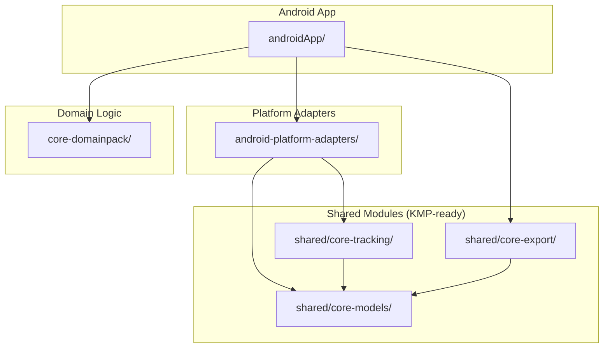
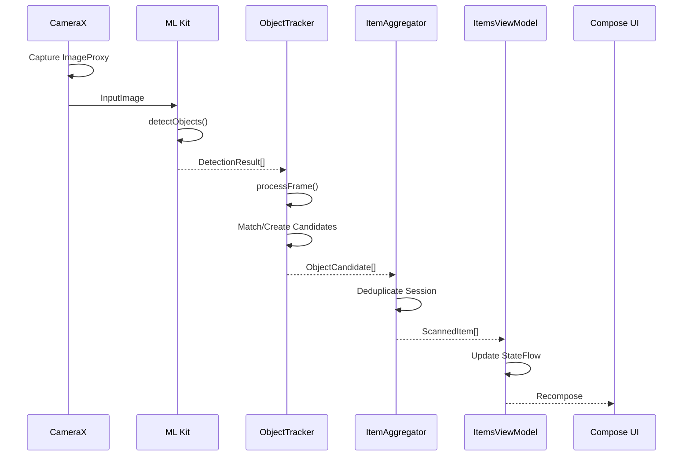
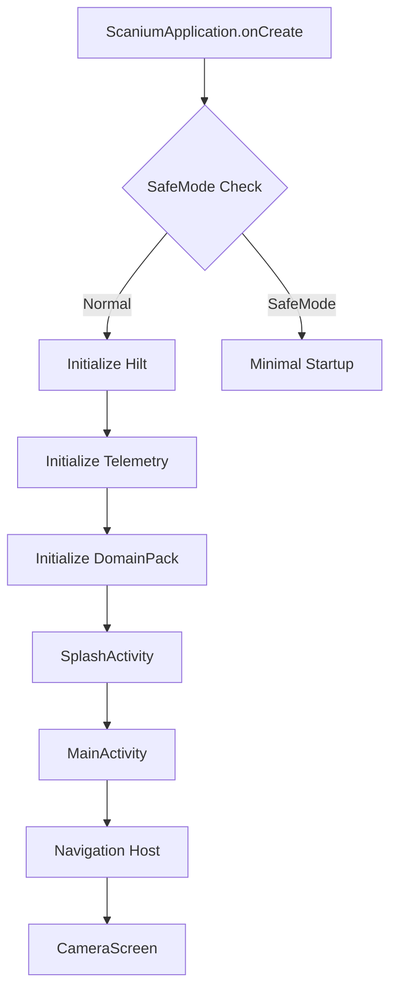

# Android App Architecture

This document provides a comprehensive overview of the Scanium Android application architecture for developer onboarding.

## Overview

Scanium is a real-time object detection and inventory management app for Android.

- **Package**: `com.scanium.app`
- **Language**: Kotlin
- **Min SDK**: 24 (Android 7.0)
- **Target SDK**: 34 (Android 14)
- **Build System**: Gradle with Kotlin DSL

Primary detection happens on-device using Google ML Kit; enhanced classification uses cloud APIs.

## Module Structure



### Module Descriptions

| Module | Purpose |
|--------|---------|
| `androidApp/` | Main Android app: Compose UI, CameraX, ML Kit, Hilt DI |
| `shared/core-models/` | KMP portable models: `ImageRef`, `NormalizedRect`, `ScannedItem` |
| `shared/core-tracking/` | Platform-free tracking: `ObjectTracker`, `ItemAggregator` |
| `shared/core-export/` | Export models for CSV, ZIP generation |
| `core-domainpack/` | Domain Pack system: 23 categories, 10 attributes per category |
| `android-platform-adapters/` | Bitmap-to-ImageRef, Rect-to-NormalizedRect conversions |

## Architecture Pattern

Scanium follows **MVVM + Clean Architecture** with **Hilt** dependency injection.

```
┌─────────────────────────────────────────────────────────────┐
│                      Presentation Layer                      │
│  ┌─────────────────┐    ┌─────────────────┐                 │
│  │  Compose UI     │◄───│   ViewModels    │                 │
│  │  (Screens)      │    │  (@HiltViewModel)│                 │
│  └─────────────────┘    └────────┬────────┘                 │
├──────────────────────────────────┼──────────────────────────┤
│                      Domain Layer │                          │
│  ┌─────────────────┐    ┌────────┴────────┐                 │
│  │  Use Cases      │    │   Repositories  │                 │
│  │  (Business)     │    │   (Interfaces)  │                 │
│  └─────────────────┘    └────────┬────────┘                 │
├──────────────────────────────────┼──────────────────────────┤
│                       Data Layer │                           │
│  ┌─────────────────┐    ┌────────┴────────┐                 │
│  │  Room Database  │    │  API Clients    │                 │
│  │  (Local)        │    │  (Remote)       │                 │
│  └─────────────────┘    └─────────────────┘                 │
└─────────────────────────────────────────────────────────────┘
```

### Key Patterns

- **@HiltViewModel**: All ViewModels use Hilt for DI
- **@AndroidEntryPoint**: Activities and Fragments are injection targets
- **StateFlow**: UI observes state via `collectAsState()`
- **SharedFlow**: One-shot events (navigation, alerts)
- **Facade Pattern**: `ItemsUiFacade` coordinates multiple managers

## Camera Detection Pipeline



### Pipeline Components

1. **CameraXManager** (`androidApp/src/main/java/com/scanium/app/camera/CameraXManager.kt`)
   - Binds CameraX Preview, ImageAnalysis, ImageCapture
   - Manages session lifecycle (start/stop)
   - Handles NO_FRAMES watchdog for self-healing

2. **ObjectDetectorClient** (`androidApp/src/main/java/com/scanium/app/ml/ObjectDetectorClient.kt`)
   - Wraps ML Kit Object Detection
   - Returns `DetectionResponse` with both ScannedItems and DetectionResults
   - Handles coordinate transformations for rotated images

3. **ObjectTracker** (`shared/core-tracking/src/commonMain/kotlin/com/scanium/core/tracking/ObjectTracker.kt`)
   - Multi-frame candidate tracking
   - Uses ML Kit trackingId or spatial IoU matching
   - Center-weighted candidate selection for foreground objects
   - Configurable via `TrackerConfig`

4. **ItemsViewModel** (`androidApp/src/main/java/com/scanium/app/items/ItemsViewModel.kt`)
   - Shared between CameraScreen and ItemsListScreen
   - Delegates to specialized managers via `ItemsUiFacade`
   - Handles pending detection queue for hypothesis selection

### Tracker Configuration

Default values in `CameraXManager.kt`:
```kotlin
TrackerConfig(
    minFramesToConfirm = 1,    // Confirm immediately
    minConfidence = 0.2f,      // 20% confidence threshold
    minBoxArea = 0.0005f,      // 0.05% of frame
    maxFrameGap = 8,           // 8 frames gap tolerance
    expiryFrames = 15          // Keep candidates for 15 frames
)
```

## State Management

### StateFlow Pattern

```kotlin
// ViewModel exposes StateFlow
val items: StateFlow<List<ScannedItem>> get() = facade.items

// UI collects as State
@Composable
fun ItemsScreen(viewModel: ItemsViewModel) {
    val items by viewModel.items.collectAsState()
    // Recompose when items change
}
```

### Key State Flows

| Flow | Type | Purpose |
|------|------|---------|
| `items` | StateFlow<List<ScannedItem>> | Current scanned items |
| `overlayTracks` | StateFlow<List<OverlayTrack>> | Camera bounding boxes |
| `itemAddedEvents` | SharedFlow<ScannedItem> | One-shot add animations |
| `hypothesisSelectionState` | StateFlow<HypothesisSelectionState> | Classification UI |
| `scanGuidanceState` | StateFlow<ScanGuidanceState> | User guidance overlay |

### ItemsUiFacade Delegation

The ViewModel delegates to specialized managers:
- **ItemsStateManager**: CRUD operations, persistence
- **ItemClassificationCoordinator**: Cloud classification, retry logic
- **OverlayTrackManager**: Camera overlay state
- **ListingStatusManager**: eBay posting status

## Persistence

### Room Database (v11)

**Entities**:
- `ScannedItemEntity` - Scanned inventory items
- `ListingDraftEntity` - eBay listing drafts
- `SessionEntity` - Scan session metadata

**Migrations**:
- Located in `androidApp/src/main/java/com/scanium/app/data/db/`
- Auto-migrations enabled where possible
- Manual migrations for complex schema changes

### Data Flow

```
ScannedItem (Domain) ←→ ScannedItemEntity (Room) ←→ SQLite
                          ↓
                    ScannedItemStore
                          ↓
                    ItemsStateManager
```

## Networking

### API Configuration

Set in `local.properties`:
```properties
scanium.api.base.url=https://api.scanium.app
scanium.api.key=your-api-key
```

### API Clients

- **ClassifierApiClient**: Cloud classification (`/v1/classify`)
- **VisionInsightsClient**: Vision API extraction (`/v1/vision/`)
- **PricingApiClient**: Price estimation (`/v1/pricing/`)
- **AssistantApiClient**: AI chat (`/v1/assist/`)

### AuthTokenInterceptor

Adds authentication headers to all API requests:
- `X-API-Key`: API key from config
- `Authorization`: Bearer token for authenticated users

## Build Flavors

| Flavor | App ID | Developer Options | Purpose |
|--------|--------|-------------------|---------|
| `prod` | `com.scanium.app` | Disabled | Production release |
| `dev` | `com.scanium.app.dev` | Available | Development/debugging |
| `beta` | `com.scanium.app.beta` | Disabled | Beta testing |

### Build Commands

```bash
./gradlew :androidApp:assembleDevDebug     # Dev flavor
./gradlew :androidApp:assembleProdRelease  # Production release
./gradlew prePushJvmCheck                  # Fast JVM-only validation
```

## Developer Mode

Available in `dev` flavor only:

- **Diagnostic Overlays**: FPS, detection stats, session info
- **Force Hypothesis Sheet**: Test multi-hypothesis UI
- **Scanning Diagnostics**: Pipeline timing logs
- **Adaptive Throttling Toggle**: Battery optimization testing
- **ROI Visualization**: Scan region overlay

Access via Settings > Developer Options (only visible in dev builds).

## App Startup Flow



### Startup Components

1. **ScaniumApplication**: Hilt application, telemetry init
2. **SafeMode**: Crash loop detection, minimal startup on repeated crashes
3. **SplashActivity**: Branding, permission checks
4. **MainActivity**: Single-activity navigation host
5. **Navigation**: Compose Navigation with NavHost

## How to Debug

### Common Failure Modes

| Symptom | Likely Cause | Where to Check |
|---------|--------------|----------------|
| No bounding boxes | Analyzer not attached | `CameraXManager.startPreviewDetection()` |
| Frozen bounding boxes | Stale session callback | `CameraSessionController.isSessionValid()` |
| Items not saving | Room migration failure | `adb logcat -s Room` |
| Classification fails | API key missing | `local.properties` |
| Camera black screen | Permission denied | `CameraXManager.startCamera()` |

### Key Log Tags

```bash
adb logcat -s ItemsViewModel:V CameraXManager:V ObjectTracker:V CAM_FRAME:V
```

- `ItemsViewModel` - State changes, item operations
- `CameraXManager` - Camera lifecycle, frame processing
- `ObjectTracker` - Candidate tracking, confirmation
- `CAM_FRAME` - Frame arrival, session lifecycle
- `TEMP_CAM_BUG_DEBUG` - Camera corruption investigation (set `TEMP_CAM_BUG_DEBUG = true`)

### Crash Points

1. **CameraX binding** - Check `CameraBindResult.error`
2. **ML Kit detection** - OOM on large images
3. **Room migrations** - Schema mismatch after upgrade
4. **Coroutine scope** - Scope cancelled during background

### Adding Debug Logs

```kotlin
// Use structured logging with TAG
Log.i(TAG, "Operation: param1=$value1, param2=$value2")

// For telemetry (async, non-blocking)
telemetry?.event("scan.item_added", TelemetrySeverity.INFO, mapOf("item_id" to item.id))
```

## Key File Locations

| Purpose | Path |
|---------|------|
| Main ViewModel | `androidApp/src/main/java/com/scanium/app/items/ItemsViewModel.kt` |
| Camera Manager | `androidApp/src/main/java/com/scanium/app/camera/CameraXManager.kt` |
| ML Kit Wrapper | `androidApp/src/main/java/com/scanium/app/ml/ObjectDetectorClient.kt` |
| Object Tracker | `shared/core-tracking/src/commonMain/kotlin/.../ObjectTracker.kt` |
| Hilt Modules | `androidApp/src/main/java/com/scanium/app/di/` |
| Compose Screens | `androidApp/src/main/java/com/scanium/app/ui/` |
| Room Database | `androidApp/src/main/java/com/scanium/app/data/db/` |
