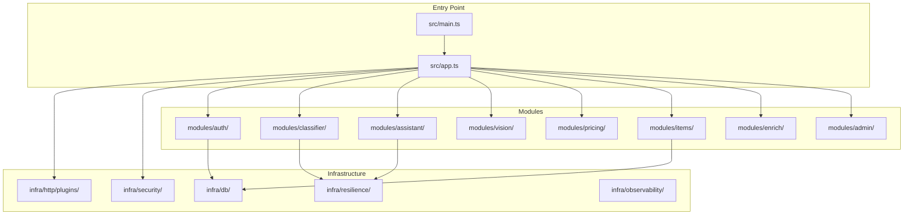
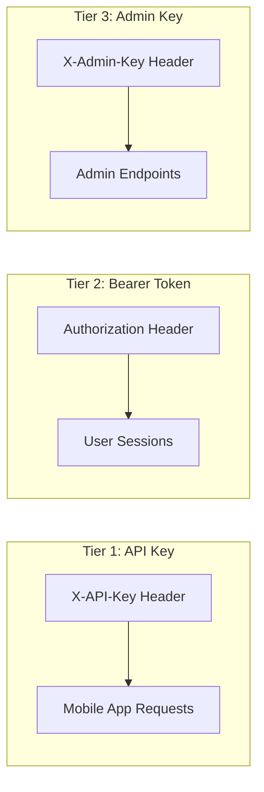
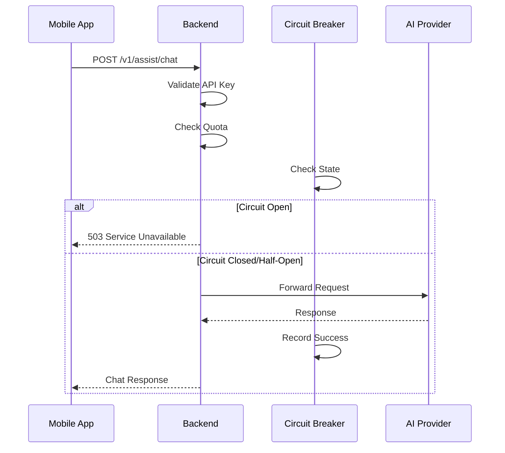
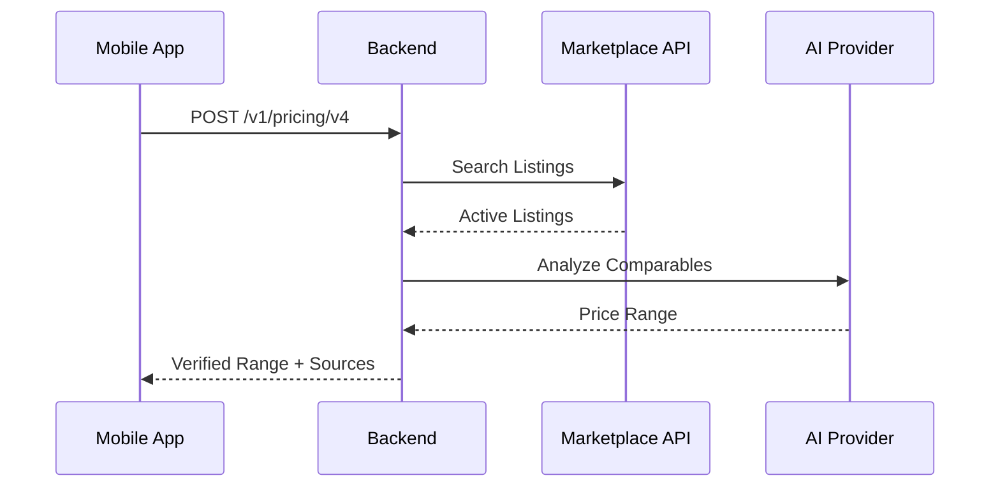
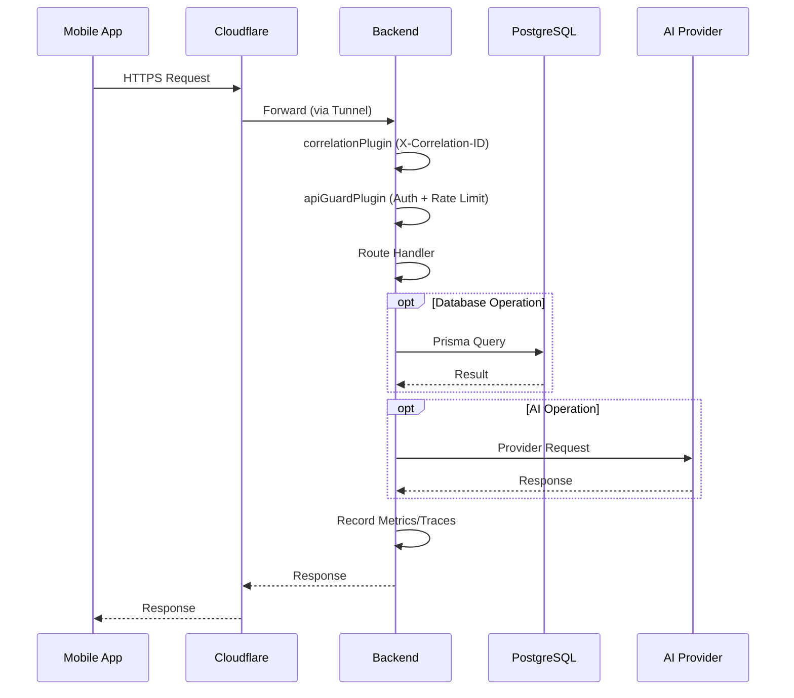

# Backend Architecture

This document provides a comprehensive overview of the Scanium backend architecture for developer onboarding.

## Overview

The Scanium backend is a Node.js API server providing cloud classification, AI assistant, pricing, and authentication services.

- **Runtime**: Node.js 20+
- **Framework**: Fastify
- **Language**: TypeScript
- **Database**: PostgreSQL (via Prisma ORM)
- **Observability**: OpenTelemetry (OTLP)

## Module Structure



### Module Descriptions

| Module | Purpose |
|--------|---------|
| `infra/db/` | Prisma client, connection management |
| `infra/http/plugins/` | CORS, CSRF, security headers, correlation IDs |
| `infra/security/` | API guard, rate limiting, request identity |
| `infra/resilience/` | Circuit breaker, retry strategies |
| `infra/observability/` | Metrics, tracing instrumentation |
| `modules/auth/` | Google OAuth, eBay OAuth, sessions |
| `modules/classifier/` | Cloud classification proxy |
| `modules/assistant/` | AI chat (OpenAI/Claude) |
| `modules/vision/` | Vision insights extraction |
| `modules/pricing/` | Price estimation (v1, v2, v3, v4) |
| `modules/items/` | Item sync API |
| `modules/enrich/` | Enrichment pipeline |
| `modules/admin/` | Admin endpoints |

## API Surface

### Route Prefixes

| Prefix | Description | Auth Required |
|--------|-------------|---------------|
| `/health`, `/healthz`, `/readyz` | Health checks | No |
| `/auth/ebay/` | eBay OAuth flow | No |
| `/v1/auth/` | Google OAuth, sessions | No |
| `/v1/account/` | Account management | Bearer Token |
| `/v1/classify` | Cloud classification | API Key |
| `/v1/assist/` | AI assistant | API Key |
| `/v1/vision/` | Vision insights | API Key |
| `/v1/items/` | Item sync | API Key |
| `/v1/pricing/` | Price estimation | API Key |
| `/v1/admin/` | Admin endpoints | Admin Key |
| `/v1/config` | Remote configuration | No |

### Protected Prefixes

Defined in `app.ts`:
```typescript
protectedPrefixes: [
  '/v1/assist/',
  '/v1/classify',
  '/v1/vision/',
  '/v1/admin/',
  '/v1/items/enrich',
  '/v1/pricing/estimate',
  '/v1/pricing/v3',
  '/v1/pricing/v4',
  '/v1/marketplaces',
]
```

## Authentication

### Three-Tier Authentication



### API Guard Plugin (`infra/security/api-guard.ts`)

- Validates `X-API-Key` header for protected routes
- In-memory rate limiting per identity (API key or IP)
- Default: 30 requests per 10 seconds

```typescript
// Rate limit configuration
maxRequests: 30,
windowMs: 10_000
```

### Session Management

- Google OAuth creates sessions in database
- Sessions have access token + refresh token
- Token hashes stored (SHA-256), not raw tokens
- Automatic session cleanup job removes expired sessions

## Preflight/Config Flow

Mobile app fetches remote configuration on startup:

```
GET /v1/config
→ Returns feature flags, version requirements, API URLs
```

Config includes:
- Minimum required app version
- Feature flags (pricing tiers, assistant modes)
- API endpoint overrides
- Maintenance mode status

## AI Assistant Integration

### Providers

1. **OpenAI** (`gpt-4o`, `gpt-4o-mini`)
2. **Claude** (`claude-3-sonnet`, `claude-3-opus`)

### Request Flow



### Safety and Quotas

- Content filtering on requests and responses
- Per-user daily quota (tracked in database)
- Circuit breaker prevents cascade failures

## Pricing Flow

### Version History

| Version | Description | Trigger |
|---------|-------------|---------|
| V1 | Baseline prices from category | Automatic |
| V2 | Visual attributes (condition, brand) | Automatic |
| V3 | OpenAI resale analysis | Manual button |
| V4 | Marketplace verification (eBay, etc.) | Manual button |

### V4 Flow (Latest)



## Database Schema

### Prisma Models

```
┌─────────────────┐     ┌─────────────────┐
│      User       │────<│  EbayConnection │
├─────────────────┤     ├─────────────────┤
│ id              │     │ id              │
│ googleSub       │     │ userId          │
│ email           │     │ accessToken*    │
│ displayName     │     │ refreshToken*   │
│ pictureUrl      │     │ expiresAt       │
│ lastLoginAt     │     │ environment     │
└────────┬────────┘     └─────────────────┘
         │
         │     ┌─────────────────┐
         ├────<│     Session     │
         │     ├─────────────────┤
         │     │ id              │
         │     │ tokenHash       │
         │     │ refreshTokenHash│
         │     │ expiresAt       │
         │     └─────────────────┘
         │
         │     ┌─────────────────┐
         ├────<│      Item       │
         │     ├─────────────────┤
         │     │ id              │
         │     │ title           │
         │     │ category        │
         │     │ attributesJson  │
         │     │ syncVersion     │
         │     └─────────────────┘
         │
         │     ┌─────────────────┐
         └────<│   VisionQuota   │
               ├─────────────────┤
               │ id              │
               │ date            │
               │ count           │
               └─────────────────┘

* Encrypted at application level (AES-256-GCM)
```

### Key Models

| Model | Purpose |
|-------|---------|
| `User` | User account, Google OAuth data |
| `EbayConnection` | eBay OAuth tokens (encrypted) |
| `Session` | Authentication sessions |
| `Item` | Synced inventory items |
| `Listing` | Marketplace listings |
| `VisionQuota` | Daily Vision API quota tracking |
| `ClassificationCorrection` | User corrections for ML learning |

## Container Layout

### Docker Services

```yaml
services:
  postgres:     # PostgreSQL database
  api:          # Scanium backend (Fastify)
  cloudflared:  # Cloudflare tunnel
```

### Local Development

```bash
scripts/backend/start-dev.sh    # Start all services
scripts/backend/stop-dev.sh     # Stop all services
cd backend && npm run dev       # Manual start
```

## Networking

### Ports

| Service | Port | Binding |
|---------|------|---------|
| Backend API | 8080 | Internal |
| PostgreSQL | 5432 | localhost |
| Cloudflare Tunnel | N/A | Outbound only |

### Cloudflare Tunnel

- Exposes backend at `scanium.gtemp1.com`
- No inbound firewall ports required
- Automatic TLS termination
- Configured via `cloudflared` container

### Internal DNS

Services communicate via Docker network hostnames:
- `scanium-backend` - API server
- `postgres` - Database
- `loki`, `tempo`, `mimir` - Observability (external network)

## Resilience

### Circuit Breaker (`infra/resilience/circuit-breaker.ts`)

States:
- **Closed**: Normal operation, requests pass through
- **Open**: Failures exceeded threshold, requests rejected
- **Half-Open**: Testing if service recovered

```typescript
CircuitBreakerOptions {
  failureThreshold: number;  // Failures before opening
  cooldownMs: number;        // Time before half-open
  minimumRequests: number;   // Min requests before evaluation
}
```

### Rate Limiting

- Per-identity (API key or IP)
- Configurable via environment variables:
  ```
  SECURITY_RATE_LIMIT_MAX=30
  SECURITY_RATE_LIMIT_WINDOW_MS=10000
  ```

### Retry Strategies

- Exponential backoff for transient failures
- Jitter to prevent thundering herd
- Max retries configurable per endpoint

## Request Lifecycle



## How to Debug

### Common Failure Classes

| Error | Cause | Resolution |
|-------|-------|------------|
| 401 Unauthorized | Missing/invalid API key | Check `X-API-Key` header |
| 429 Too Many Requests | Rate limit exceeded | Wait for `Retry-After` |
| 502 Bad Gateway | Backend crashed/unreachable | Check container logs |
| 503 Service Unavailable | Circuit breaker open | Wait for cooldown |
| 504 Gateway Timeout | Slow AI provider | Check provider status |

### Log Locations

```bash
# Backend container logs
docker logs scanium-backend -f

# Structured logs in Loki
# Query: {source="scanium-backend"}
```

### Key Log Fields

- `correlationId`: Request tracking ID
- `userId`: Authenticated user (if any)
- `path`: API route
- `statusCode`: Response status
- `durationMs`: Request duration

### Database Debugging

```bash
# Connect to PostgreSQL
docker exec -it postgres psql -U scanium

# Check recent sessions
SELECT * FROM sessions ORDER BY created_at DESC LIMIT 10;

# Check item sync
SELECT id, title, sync_version, updated_at FROM items WHERE user_id = 'xxx';
```

### Health Checks

- `GET /health` - Basic liveness
- `GET /healthz` - Kubernetes liveness probe
- `GET /readyz` - Kubernetes readiness probe

All return `200 OK` with `{"status": "ok"}` when healthy.

## Key File Locations

| Purpose | Path |
|---------|------|
| App Builder | `backend/src/app.ts` |
| Entry Point | `backend/src/main.ts` |
| Configuration | `backend/src/config/index.ts` |
| API Guard | `backend/src/infra/security/api-guard.ts` |
| Circuit Breaker | `backend/src/infra/resilience/circuit-breaker.ts` |
| Database Schema | `backend/prisma/schema.prisma` |
| Assistant Routes | `backend/src/modules/assistant/routes.ts` |
| Pricing Routes | `backend/src/modules/pricing/routes.ts` |
| Auth Routes | `backend/src/modules/auth/google/routes.ts` |
