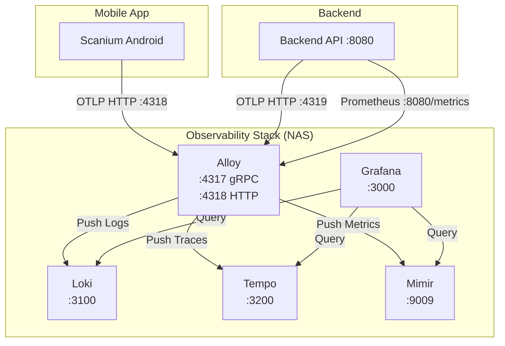
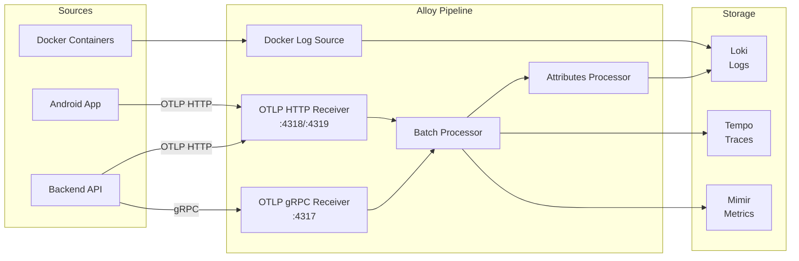
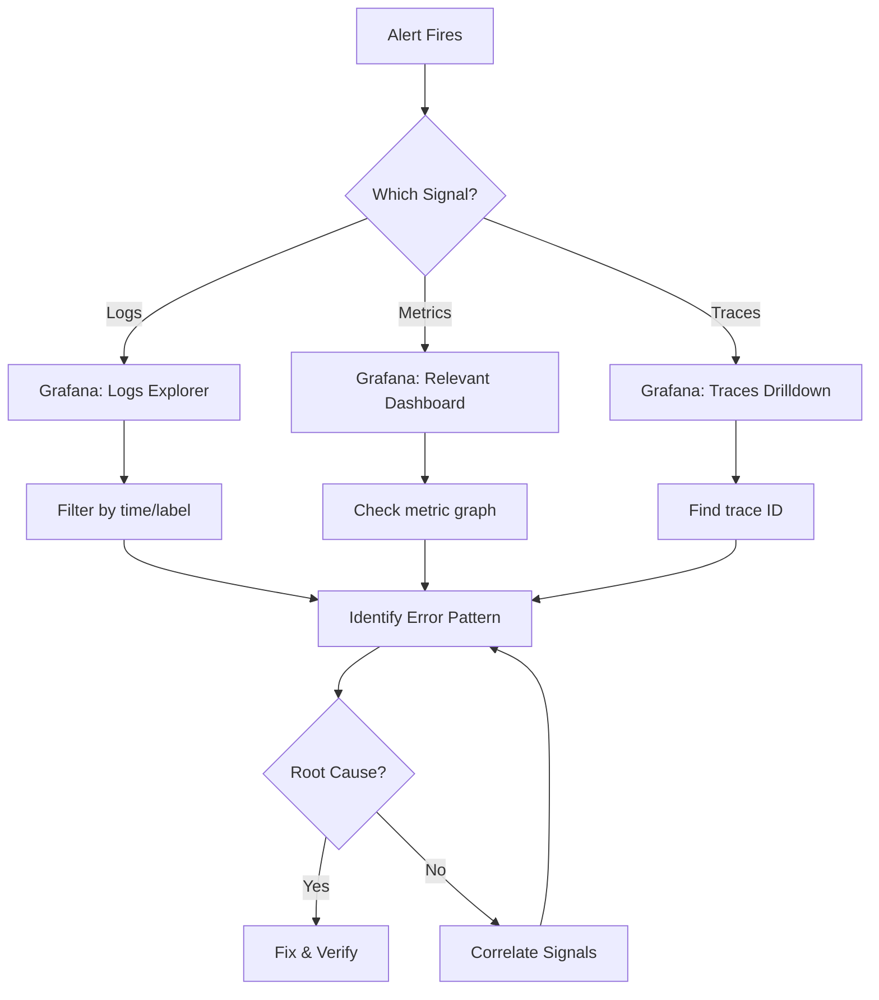

# Monitoring & Observability Architecture

This document provides a comprehensive overview of the Scanium observability stack for developer onboarding.

## Overview

Scanium uses the **LGTM stack** (Loki, Grafana, Tempo, Mimir) with **Grafana Alloy** for telemetry collection.

- **Logs**: Loki (LogQL)
- **Metrics**: Mimir (Prometheus-compatible)
- **Traces**: Tempo (OpenTelemetry)
- **Visualization**: Grafana
- **Collection**: Grafana Alloy (OTLP receiver)

The stack runs on NAS (Synology DS418play) for 24/7 availability.

## Container Architecture



### Service Details

| Service | Image | Ports | Purpose |
|---------|-------|-------|---------|
| Alloy | `grafana/alloy:v1.0.0` | 4317 (gRPC), 4318 (HTTP), 12345 (UI) | OTLP receiver, telemetry router |
| Loki | `grafana/loki:2.9.3` | 3100 | Log aggregation |
| Tempo | `grafana/tempo:2.7.0` | 3200, 4317 | Distributed tracing |
| Mimir | `grafana/mimir:2.11.0` | 9009 | Metrics storage (Prometheus-compatible) |
| Grafana | `scanium-grafana:latest` | 3000 | Visualization, dashboards, alerting |

### Networks

- `scanium-observability` - Internal observability network
- `backend_scanium-network` - External network for backend access

## Telemetry Data Flow



### Signal Routing

| Signal | Source | Processor | Destination |
|--------|--------|-----------|-------------|
| Logs | Mobile OTLP | batch.mobile → attributes.mobile | Loki |
| Logs | Backend OTLP | batch.backend → attributes.backend_logs | Loki |
| Logs | Docker containers | loki.source.docker | Loki |
| Metrics | Mobile OTLP | batch.mobile | Mimir |
| Metrics | Backend OTLP | batch.backend | Mimir |
| Metrics | Span metrics | connector.spanmetrics | Mimir |
| Metrics | Self-observability | prometheus.scrape | Mimir |
| Traces | Mobile/Backend OTLP | batch → exporter.otlp | Tempo |

## Logging Stack

### Loki Configuration

```yaml
# Retention: 72 hours
retention_period: 72h

# Ingestion limits
ingestion_rate_mb: 4
ingestion_burst_size_mb: 6
max_streams_per_user: 10000
```

### Log Labels (Low Cardinality)

| Label | Values | Description |
|-------|--------|-------------|
| `source` | `scanium-mobile`, `scanium-backend`, `pipeline` | Origin of logs |
| `env` | `dev`, `stage`, `prod` | Environment |
| `platform` | `android` | Mobile platform |
| `app_version` | `1.8.0`, `1.8.1`, ... | App version |
| `build_type` | `debug`, `release` | Build variant |
| `event_name` | Various | Telemetry event type |

### Sample LogQL Queries

```logql
# All mobile errors
{source="scanium-mobile"} |~ `(?i)error|exception|fatal`

# Backend 5xx responses
{source="scanium-backend"} | json | http_status >= 500

# Scan sessions started
{source="scanium-mobile", event_name="scan.session_started"}
```

## Metrics Stack

### Mimir Configuration

- Single-node deployment (`-target=all`)
- Query recent data from ingesters (`-querier.query-ingesters-within=12h`)
- S3-compatible local storage

### Scrape Targets

Alloy scrapes metrics from:

| Target | Endpoint | Interval |
|--------|----------|----------|
| Alloy | localhost:12345 | 60s |
| Loki | loki:3100 | 60s |
| Tempo | tempo:3200 | 60s |
| Mimir | mimir:9009 | 60s |
| Backend | scanium-backend:8080/metrics | 60s |

### Key Metrics

| Metric | Type | Description |
|--------|------|-------------|
| `http_server_request_duration_seconds` | Histogram | Backend request latency |
| `ml_inference_latency_ms` | Histogram | ML Kit inference time |
| `otelcol_exporter_send_failed_*` | Counter | Alloy export failures |
| `up{job="..."}` | Gauge | Service availability |
| `traces_spanmetrics_calls_total` | Counter | Span call counts |
| `traces_spanmetrics_latency_*` | Histogram | Span latency distribution |

## Tracing Stack

### Tempo Configuration

```yaml
# Retention
compaction:
  block_retention: 72h

# Receivers (via Alloy)
distributor:
  receivers:
    otlp:
      protocols:
        grpc:
          endpoint: "0.0.0.0:4317"
```

### Span Metrics Connector

Alloy generates metrics from traces:

```hcl
otelcol.connector.spanmetrics "default" {
  histogram {
    explicit {
      buckets = ["10ms", "25ms", "50ms", "100ms", "250ms", "500ms", "1s", "2.5s", "5s", "10s"]
    }
  }

  dimension { name = "service.name" }
  dimension { name = "span.name" }
  dimension { name = "span.kind" }
  dimension { name = "status.code" }
}
```

Produces:
- `traces_spanmetrics_calls_total`
- `traces_spanmetrics_latency_bucket`

## Alloy Pipeline

### Receivers

```hcl
# Mobile (primary)
otelcol.receiver.otlp "mobile_http" {
  http { endpoint = "0.0.0.0:4318" }
}

otelcol.receiver.otlp "mobile_grpc" {
  grpc { endpoint = "0.0.0.0:4317" }
}

# Backend
otelcol.receiver.otlp "backend_http" {
  http { endpoint = "0.0.0.0:4319" }
}
```

### Processors

- **Batch**: Groups telemetry (100 items, 5s timeout)
- **Attributes**: Promotes log attributes to Loki labels

### Exporters

- **Loki**: `otelcol.exporter.loki` → `loki.write`
- **Tempo**: `otelcol.exporter.otlp` (gRPC to tempo:4317)
- **Mimir**: `otelcol.exporter.prometheus` → `prometheus.remote_write`

## Grafana Dashboards

14 provisioned dashboards:

| Dashboard | File | Purpose |
|-----------|------|---------|
| Logs Explorer | `logs-explorer.json` | Log search and analysis |
| LGTM Stack Health | `lgtm-stack-health.json` | Observability stack status |
| Mobile App Health | `mobile-app-health.json` | App telemetry overview |
| OpenAI Runtime | `openai-runtime.json` | AI provider metrics |
| Scan Performance | `scan-performance.json` | ML inference latency |
| Ops Overview | `ops-overview.json` | Operations dashboard |
| Backend Errors | `backend-errors.json` | API error analysis |
| System Overview | `system-overview.json` | Infrastructure metrics |
| Backend API Performance | `backend-api-performance.json` | API latency/throughput |
| Errors | `errors.json` | Error aggregation |
| Traces Drilldown | `traces-drilldown.json` | Distributed trace analysis |
| Backend Health | `backend-health.json` | Backend service health |
| Pipeline Health | `pipeline-health.json` | Alloy pipeline metrics |
| Pricing V4 | `pricing-v4.json` | Pricing feature metrics |

### Dashboard Provisioning

```
monitoring/grafana/provisioning/dashboards/
├── dashboards.yaml          # Provider configuration
└── ...                      # Dashboard JSON files

monitoring/grafana/dashboards/
├── *.json                   # Dashboard definitions
```

## Alert Rules

20+ alert rules organized by category:

### Error Rate Alerts (Loki)

| Alert | Threshold | Severity |
|-------|-----------|----------|
| Error Rate Spike (prod) | >50 errors/10min | Critical |
| Error Rate Spike (stage) | >100 errors/10min | Warning |
| Error Rate Spike (dev) | >200 errors/10min | Info |

### Telemetry Health Alerts (Loki)

| Alert | Condition | Severity |
|-------|-----------|----------|
| Telemetry Drop (prod) | 0 events in 15min | Critical |
| No Scan Sessions (prod) | 0 sessions in 30min | Warning |

### Performance Alerts (Mimir)

| Alert | Threshold | Severity |
|-------|-----------|----------|
| Inference Latency (prod) | p95 > 2000ms | Warning |
| Inference Latency (stage) | p95 > 3000ms | Info |

### Pipeline Health Alerts (Mimir)

| Alert | Condition | Severity |
|-------|-----------|----------|
| Alloy Down | up < 1 for 2min | Critical |
| Loki Down | up < 1 for 2min | Critical |
| Tempo Down | up < 1 for 2min | Critical |
| Mimir Down | up < 1 for 2min | Critical |
| Log Export Failures | any failures in 5min | Critical |
| Metric Export Failures | any failures in 5min | Critical |
| Span Export Failures | any failures in 5min | Critical |
| Receiver Refusing Data | any refused in 5min | Warning |
| Queue Backpressure | >80% capacity | Warning |

### Backend API Alerts (Mimir)

| Alert | Threshold | Severity |
|-------|-----------|----------|
| 5xx Error Rate (prod) | >5% | Critical |
| 5xx Error Rate (stage) | >10% | Warning |
| High Latency (prod) | p95 > 500ms | Warning |
| High Latency (stage) | p95 > 1000ms | Info |

## Health Checks

### Endpoint Health

| Endpoint | Service | Expected |
|----------|---------|----------|
| `http://loki:3100/ready` | Loki | 200 |
| `http://tempo:3200/ready` | Tempo | 200 |
| `http://mimir:9009/ready` | Mimir | 200 |
| `http://grafana:3000/api/health` | Grafana | 200 |
| TCP localhost:12345 | Alloy | Open |

### Docker Health Checks

All services have health checks configured:
```yaml
healthcheck:
  test: ["CMD", "wget", "--spider", "-q", "http://localhost:PORT/ready"]
  interval: 10s
  timeout: 5s
  retries: 3
  start_period: 15s
```

## NAS Operations

All monitoring operations require SSH to NAS:

```bash
# Restart monitoring stack
ssh nas "docker compose -p scanium-monitoring restart"

# View container status
ssh nas "docker ps -a --filter name=scanium-"

# View Alloy logs
ssh nas "docker logs scanium-alloy -f"

# View Loki logs
ssh nas "docker logs scanium-loki -f"

# Check disk usage
ssh nas "du -sh /volume1/docker/scanium-monitoring/data/*"
```

### Compose Commands

```bash
# From NAS
cd /volume1/docker/scanium-monitoring

# Start stack
docker compose up -d

# Stop stack
docker compose down

# View logs
docker compose logs -f

# Rebuild Grafana
docker compose build grafana
docker compose up -d grafana
```

## How to Debug

### Incident Response Flow



### Healthy vs Degraded Indicators

| Component | Healthy | Degraded |
|-----------|---------|----------|
| Alloy | `up{job="alloy"}` = 1, no export failures | Export failures > 0, queue > 50% |
| Loki | `up{job="loki"}` = 1, ingestion rate normal | High ingestion errors, slow queries |
| Tempo | `up{job="tempo"}` = 1, spans received | Compaction failures, no spans |
| Mimir | `up{job="mimir"}` = 1, queries respond | High query latency, ingestion errors |
| Grafana | `/api/health` = 200 | Dashboard load errors |

### Common Issues

| Symptom | Likely Cause | Check |
|---------|--------------|-------|
| No mobile telemetry | App not sending, Alloy down | Alloy logs, app network |
| No backend metrics | Scrape failing, backend down | Alloy scrape config, backend health |
| Missing traces | Tempo overloaded, Alloy queue full | Tempo compaction, Alloy queue metrics |
| Dashboard empty | Datasource misconfigured | Grafana datasource test |
| Alerts not firing | Rule syntax error, datasource UID | Alert rule evaluation logs |

### Debug Commands

```bash
# Test Loki query
curl -G 'http://nas:3100/loki/api/v1/query' \
  --data-urlencode 'query={source="scanium-mobile"}'

# Test Mimir query
curl 'http://nas:9009/prometheus/api/v1/query?query=up'

# Test Tempo
curl 'http://nas:3200/api/traces/TRACE_ID'

# Check Alloy targets
curl 'http://nas:12345/api/v0/component/prometheus.scrape.backend/targets'
```

## Gaps/TODOs

Current limitations to address:

1. **No alerting notifications** - Alerts fire but no Slack/email configured
2. **No long-term retention** - 72h retention; consider S3 for historical data
3. **Single-node deployment** - No HA; NAS is single point of failure
4. **No exemplars** - Trace-metric linking via exemplars not configured
5. **Missing mobile metrics** - Some app metrics not yet instrumented
6. **No SLOs** - Service Level Objectives not defined or tracked

## Key File Locations

| Purpose | Path |
|---------|------|
| Docker Compose | `monitoring/docker-compose.yml` |
| Alloy Config | `monitoring/alloy/alloy.hcl` |
| Loki Config | `monitoring/loki/loki.yaml` |
| Tempo Config | `monitoring/tempo/tempo.yaml` |
| Mimir Config | `monitoring/mimir/mimir.yaml` |
| Datasources | `monitoring/grafana/provisioning/datasources/datasources.yaml` |
| Alert Rules | `monitoring/grafana/provisioning/alerting/rules.yaml` |
| Dashboards | `monitoring/grafana/dashboards/*.json` |
